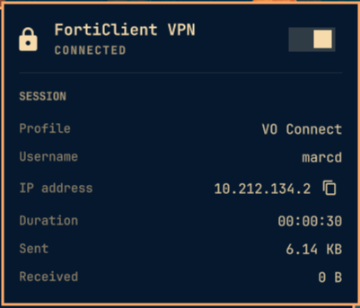

# FortiClient VPN for Omarchy



An [Omarchy](https://omarchy.org/) bar widget for the official
FortiClient VPN client. It connects and disconnects your saved FortiClient
profiles from the bar and shows the live session details.

## Features

- Bar icon shows whether the VPN is connected
- Click the icon to open a panel with a connect/disconnect switch and the
  session details: profile, IP, username, duration, bytes sent and received
- One-click copy of your VPN IP address
- Right-click the icon to connect or disconnect without opening the panel
- Middle-click the icon to refresh
- If a connection fails because the profile has no saved password or the
  server certificate isn't trusted yet, the panel shows the one-time
  terminal command that fixes it

## Requirements

- The `forticlient-vpn` package (from the AUR), which provides the
  `fortivpn` command:

  ```bash
  yay -S forticlient-vpn
  ```

- At least one VPN profile already set up in FortiClient. The widget uses
  your existing profiles and does not create them.

## Install

```bash
omarchy plugin add https://github.com/Masqueradeza/omarchy-forticlient.git --enable
```

You'll be asked which section of the bar to put it in; it defaults to the
right.

### First connection

The widget connects without asking for anything. That means the profile
needs a saved password and FortiClient needs to trust the server
certificate. If either is missing, the panel shows the command to run once
in a terminal, for example:

```bash
fortivpn connect "My Profile" -p -s
```

After that, connecting from the bar works on its own.

## Settings

Change these in the widget's settings in Omarchy:

| Setting | Default | Description |
| --- | --- | --- |
| VPN profile | *(blank)* | Name of the FortiClient profile to use. Blank uses the first profile from `fortivpn list`. |
| Refresh interval | 3 seconds | How often the status is checked (1–60). |

## Update

```bash
omarchy plugin update marcd.forticlient
```

## Remove

```bash
omarchy plugin remove marcd.forticlient
```

## License

MIT
